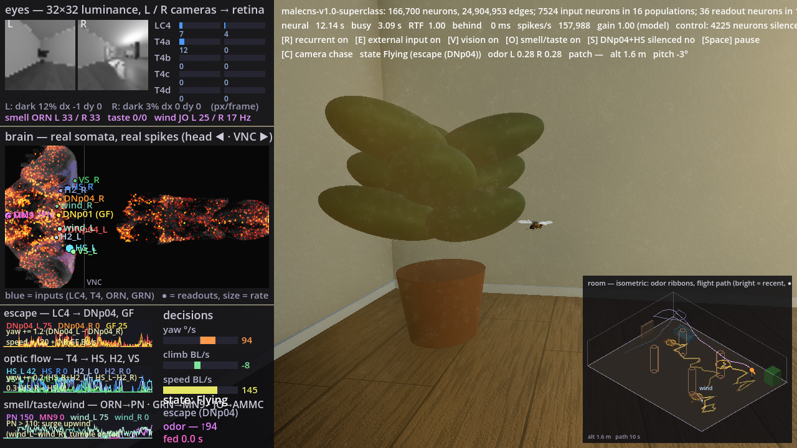

# dotFly

**A native .NET inference engine for fly-connectome spiking models.**

dotFly runs the *Drosophila* connectomes — [MaleCNS v1.0](https://male-cns.janelia.org/) (166,700
neurons, 25.6 M directed edges) and [FlyWire](https://flywire.ai/) v630/v783 — as leaky
integrate-and-fire point-neuron networks, in pure C# on .NET 11, fast enough to sit inside a game
loop. It is a library first: Godot, console apps, tests and benchmarks link it in-process. No
Python, no server, no sidecar.

> **Status: initial prototype.** Everything below works end to end on an 8-core laptop:
> checkpoints build from the MaleCNS v1.0 and FlyWire releases; the float64 reference backend
> reproduces Brian2 spike-for-spike; the float32 SIMD backend is bit-identical across thread
> counts and runs the whole 166,700-neuron MaleCNS in real time inside Godot; the engine API,
> readout adapters, CLI and a 3D "fly in a living room" demo are in place. What comes next is a
> list of features, not milestones — see [Roadmap](docs/roadmap.md). **Documentation:**
> [docs/](docs/) (DocFX site: guides, findings, API reference).

## What it is — and is not

The connectome is a *measured wiring diagram*. Everything that makes it run — the neuron equations,
the parameters, the sign assigned to each neurotransmitter, the sensory encoder and the motor
decoder — is an engineering choice. dotFly reproduces the published [Shiu et al. 2024](https://doi.org/10.1038/s41586-024-07763-9)
model exactly (float64 reference, validated against Brian2) and makes every other choice explicit,
recorded in the checkpoint's provenance, and switchable so that a demo can show what the wiring
contributes versus what the adapters contribute.

It is **not** a digital fly, a preserved animal, or a brain that plays games by itself. A moving body
driven by descending-neuron rates through a hand-tuned decoder is a programmable, testable model of
neural circuitry — a valuable thing, and the only claim made here.

## What you are looking at

Demos of "a fly brain playing a game" are appearing. Every one of them, including this one, is
three things stacked: the **wiring** (measured by electron microscopy), the **dynamics** (one
leaky integrate-and-fire model with one synaptic weight for all 24.9 M synapses — Shiu et al.'s
single calibrated parameter, reproduced exactly here) and the **adapters** (what feeds the
sensory neurons, what the motor neurons' spikes are turned into — engineering). dotFly's point is
to make the third layer as thin and as visible as possible and to say on screen which is which:
the room demo labels every number as *measured*, *calibrated* or *fixed*, draws the brain's real
spikes at real soma positions, prints the decoder's rules next to the readouts they use, and
documents what the model turned out not to do (its own navigation circuit is silent). See
[docs/honesty.md](docs/honesty.md) and [docs/findings.md](docs/findings.md).



## Design in one paragraph

A memory-mapped checkpoint file (`.dfb`) holds the graph in CSR form with exact 64-bit body IDs,
annotations, named neuron sets and a provenance header. Simulation state (~2 MB for MaleCNS) lives in
64-byte-aligned unmanaged memory; each 0.1 ms step is a SIMD sweep over all neurons plus an
event-driven scatter over the out-edges of the neurons that spiked, partitioned across a dedicated
thread pool so results are bit-identical at any thread count. A counter-based RNG makes stimuli
reproducible across CPU, GPU and replay. Inputs and outputs are float vectors bound to neuron sets, so
any readout adapter — hand rules, a linear map, an ONNX or ML.NET model — consumes the same span.

## Building

Requires the .NET 11 SDK (RC1 or later; pinned in `global.json`).

```powershell
dotnet build -c Release
dotnet test  -c Release                                   # unit tests need no data
dotnet run --project src/DotFly.Cli -c Release -- info
```

## Data and checkpoints

Connectome releases are downloaded into the git-ignored `.data/` folder and converted once into
memory-mapped `.dfb` checkpoints:

```powershell
# MaleCNS v1.0 flat connectome (https://male-cns.janelia.org/download/, CC BY 4.0), ~1.6 GB:
#   .data/malecns-v1.0/body-annotations-male-cns-v1.0-minconf-0.5.feather
#   .data/malecns-v1.0/body-neurotransmitters-male-cns-v1.0.feather
#   .data/malecns-v1.0/connectome-weights-male-cns-v1.0-minconf-0.5.feather          (or -traced-only)
dotnet run --project src/DotFly.Cli -c Release -- build malecns .data/malecns-v1.0 --filter superclass
dotnet run --project src/DotFly.Cli -c Release -- build malecns .data/malecns-v1.0 --filter traced

# FlyWire v630 as shipped with the Shiu et al. model (github.com/philshiu/Drosophila_brain_model):
#   .data/shiu2024/2023_03_23_completeness_630_final.csv, 2023_03_23_connectivity_630_final.parquet
dotnet run --project src/DotFly.Cli -c Release -- build flywire .data/shiu2024/2023_03_23_completeness_630_final.csv .data/shiu2024/2023_03_23_connectivity_630_final.parquet -m 630

dotnet run --project src/DotFly.Cli -c Release -- inspect .data/malecns-v1.0/malecns-v1.0-superclass.dfb --body 10001
dotnet run --project src/DotFly.Cli -c Release -- run .data/shiu2024/flywire-v630.dfb --stimulate <sugar GRN ids> --hz 150 --seconds 1
dotnet run --project src/DotFly.Cli -c Release -- bench .data/malecns-v1.0/malecns-v1.0-superclass.dfb --scenario type:T4a --threads 1,4,8
dotnet test -c Release --project tests/DotFly.Tests.Integration   # count/experiment tests; skip without .data
```

`--filter superclass` keeps bodies with a `superclass` annotation (166,700 neurons; the graph used by
the public demos); `--filter traced` keeps `status == Traced` (165,122; the official `traced-only`
export). Edges whose presynaptic transmitter is unclear or histamine are dropped as `g += 0` no-ops;
the structural counts stay in the checkpoint's provenance.

`tools/brian2_golden.py` regenerates the Brian2 reference fixtures (needs a Python environment with
`brian2`, `pandas`, `pyarrow`; it is not part of the build).

## Using the engine

```csharp
using DotFly;

using Brain brain = Brain.Open(".data/shiu2024/flywire-v630.dfb");
using Simulation sim = brain.CreateSimulation(new SimulationOptions { Seed = 1 });

NeuronSet sugar = brain.ByBodyIds("sugar_GRN_R", sugarIds);          // exact 64-bit IDs
sim.Input(sugar, InputKind.PoissonToV).Fill(150f);                   // Poisson drive, 150 Hz each
OutputPort mn9 = sim.Output(brain.ByBodyId(720575940660219265), OutputKind.Rate(50.Ms()));
sim.OnSpikes += (step, ReadOnlySpan<int> ids) => { /* raster, counters… */ };

sim.Run(1.Seconds());                                                 // neural time
Console.WriteLine($"MN9 {mn9.Snapshot.Mean():F1} Hz at {sim.Clock.RealTimeFactor:F1}× real time");
```

For a game loop, `new RealtimeDriver(sim).Start()` runs the network on its own thread; the game
thread writes `InputPort`s and reads `OutputPort.Snapshot` frames (lock-free), and a readout
adapter (`LinearAdapter`, `ThresholdAdapter`, or an ONNX/ML.NET model) turns a frame's
values into actions — labelled *fixed*, *calibrated* or *trained*, because the graph never learns.
`sim.Record("run.dfs")` captures spikes, input writes and output frames; `Recording.Read(...)
.Replay(sim)` reproduces the run. `samples/DotFly.Sample.SugarExperiment` is the worked example.

## Demos and tools

- `dotfly explore <checkpoint> --stimulate type:T4a` — live spike raster and statistics of a checkpoint
  running in real time; keys toggle recurrent transmission (`r`), external input (`e`) and the rate (`+`/`-`).
- `dotfly run <checkpoint> --stimulate "type:LC4@L;type:ORN_DM1" --silence "class:Kenyon_Cell;type:lLN*"
  --stim-seconds 1 --gain 1.0` — stimulate one or more populations (IDs, `set:`, `type:`/`class:`/
  `superclass:` with `@L`/`@R`, `;` unions), optionally silence others, and report what fires during
  and after the stimulus (the tool used to find and tame the runaway attractors).
- `dotfly inspect <checkpoint> --upstream-of <ID> --hops 2 --min-weight 5` — who drives a neuron
  (the way the GRN → MN9 feeding pathway was found); `--downstream-of` for the other direction.
- `samples/DotFly.Sample.Godot` — a Godot 4 (.NET) scene: a retina encoder drives LC4, the escape
  descending neurons LC4 reaches (DNp04, DNp01) are read out, and a *fixed* decoder steers a 2D fly
  away from the looming target. `R`/`E`/`S` cut the wiring, the input, or the readout cells live.
  See its README for the two Godot-specific switches (real executable, `DOTNET_ROLL_FORWARD_TO_PRERELEASE`).
- `samples/DotFly.Sample.Godot3D` — the closed loop in 3D, in a photoreal living room (SDFGI, SSR,
  soft shadows, procedural PBR materials): the fly's own eye images (two 32×32 luminance renders,
  one camera per compound eye) are encoded into LC4 and T4a–d channels per eye, an odor field
  (raymarched with noise exactly where it is) into ORN_DM1, and
  sugar contact into the gustatory neurons; the measured circuits LC4 → DNp04 / Giant Fiber (escape),
  T4 → HS / VS (optic flow), ORN_DM1 → DM1_lPN (smell) and GRN → MN9 (feeding) are read out; a *fixed*
  decoder combines escape, optomotor counter-turning, altitude hold, run-and-tumble odor search,
  landing and feeding (an animated fly that dips its head and pumps its proboscis). The left panels
  show the eyes, the brain lit by real spikes at real soma positions, and the readout time-graphs
  wired to the decisions; an isometric room map traces the flight. Runs at gain 1.0 with 4,225
  neurons (Kenyon cells + antennal-lobe LNs) silenced to remove the model's runaway attractors.
  `-- --flies 4` puts four flies in the room, each a full independent simulation.
- `samples/DotFly.Sample.TrainReadout` — records output frames, trains a readout three ways (plain C#
  logistic regression → `LinearAdapter`, ML.NET → `MLNetAdapter`, ML.NET exported to ONNX →
  `OnnxAdapter`) and evaluates them on held-out episodes. Only the adapter is trained; the graph is not.
- `samples/DotFly.Sample.SugarExperiment` — the Shiu et al. example (30 trials + silencing) with a
  comparison against the published rates.

## Performance (Ryzen 7 5800HS laptop, 8 cores / AVX2, 8 threads)

| Scenario | Neurons | Real-time factor | Steps/s |
|---|---|---|---|
| FlyWire v630, 21 sugar GRNs @ 150 Hz (Shiu et al. experiment) | 127,400 | 19.6× | 196,000 |
| MaleCNS v1.0, no input | 166,700 | 14.5× | 145,000 |
| MaleCNS v1.0, 1,684 T4a neurons @ 150 Hz (0.5 M spikes/s, 0.9 G deliveries/s) | 166,700 | 6.2× | 62,000 |

One simulated second of the Shiu sugar experiment takes ~50 ms here; Brian2 (numpy target) needs
~25 s for the same run on this machine, and the paper reported about five minutes per CPU thread.
Results are bit-identical for any thread count, and the float32 backend reproduced the float64
reference's per-neuron spike counts exactly on that run. `dotfly bench` prints these tables.

## Layout

```
src/DotFly.Core      checkpoint reader, neuron/graph tables, NeuronModel, backend interfaces, memory, RNG
src/DotFly.Data      MaleCNS / FlyWire release readers (Arrow) → .dfb checkpoint builder
src/DotFly.Cpu       SIMD LIF kernels, blocked-CSR delivery, compute thread pool
src/DotFly.Engine    NeuronSet, input/output ports, clock, real-time driver, recorder, readout adapters
src/DotFly.Adapters.*  ONNX Runtime and ML.NET readout adapters (separate packages)
src/DotFly.Cli       dotfly build / inspect / run / bench / explore / info
tests/               unit tests (golden traces), integration tests (real checkpoints, opt-in)
benchmarks/          BenchmarkDotNet
tools/               brian2_golden.py — offline generator of Brian2 reference traces (fixtures only)
samples/             SugarExperiment, TrainReadout, Godot (2D), Godot3D (the room)
docs/                DocFX site: guides, the room demo, measured vs engineered, findings, CLI, API reference
```

## Data and licences

dotFly code is licensed under the [GPL v3](LICENSE). Connectome data are downloaded separately
from their publishers and carry their own licences — MaleCNS and the FlyWire connectivity release are
CC BY 4.0; retain their attribution. The Shiu et al. reference model (MIT) is used as a specification
and for generating test fixtures; it is not vendored. The fly model in
`samples/DotFly.Sample.Godot3D/models/fly.glb` is a low-poly reconstruction referencing "Fruit Fly
Drosophila" by yuqian.ye (Alicia Hidalgo Lab, University of Birmingham) on Sketchfab; it is a
visual asset, not a calibrated biological model.

## References

- Berg, Beckett, Costa, Schlegel et al., *Sexual dimorphism in the complete Drosophila male central nervous system connectome*, Cell 2026 — [MaleCNS downloads](https://male-cns.janelia.org/download/)
- Shiu et al., *A Drosophila computational brain model reveals sensorimotor processing*, Nature 2024 — [philshiu/Drosophila_brain_model](https://github.com/philshiu/Drosophila_brain_model)
- Dorkenwald et al., *Neuronal wiring diagram of an adult brain*, Nature 2024 — [FlyWire v783 connectivity](https://zenodo.org/records/10676866)
